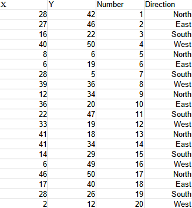
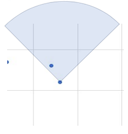
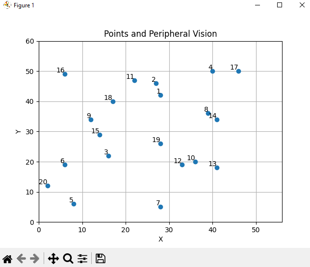

# Peripheral Cone Data 📈👁️
## Instroduction 📖
The program takes as input a csv file that contains data representing the following table:

<div align="center">
    
</div>

+ 'X' and 'Y' - Cartesian Coordinates
+ 'Number' - Point's ID
+ 'Direction' - Point's direction

The user is prompt to choose a point, a viewing angle and a distance. The point's ID is used to select the data point in the table. The viewing angle (in degrees) is the angular direction towards one side starting from the 'Direction' value of the data point. The distance value is the radius distance starting from the coordinates of the selected point.

These values are then used to build an imaginary cone with the vertex starting from the selected data point. The curvature of the cone extends to both sides by the inserted viewing angle with the middle point being on the 'Direction' value (which would be a Cardinal Point: North, East, West, South). The radius of the cone depends on the selecteed distance. The following picture represent a viewing angle of 45 degrees on each side:

<div align="center">
    
</div>

The program then returns all of the other data points contained in this imaginary cone.

## How to Run the Program 🗔
### Programming Language Needed 🐍⌨️

```
Python3
```

### Libraries Needed 📚
+ csv
+ math
+ matplotlib
+ sys

If any of the libraries need to be installed, you can execute the following line:

```
pip install (library)
```

### Execute ▶️
Start by cloning the repository in your local machine.

```
git clone https://github.com/ErTucci674/peripheral-cone-data.git
```

Enter the following line of code to run the program:

```
python main.py data.csv
```

## Files and Code 🗃️
In the `main.py` file , `main()`, the executed function is contained. When the program is ran, the user's input is checked to make sure the correct format is executed.

```python
# --- Data Reading ---
# Read user input
len_argv = len(sys.argv)
if len_argv != 2:
    print("Usage: python main.py data.csv")
    sys.exit(1)

# Check that the file exists
try:
    data_file = open(sys.argv[1], "r")
except:
    print(f"Error: {sys.argv[1]} file not found")
    sys.exit(404)

data_reader = csv.DictReader(data_file)
```

The first _if statement_ checks if the user inserted the exact number of arguments (3) by using the `sys` library. The _try - except_ checks if the chosen file exists. If an error is 'caught' the program exits with an error. Otherwise, the file is converted into a _Dictionary_ by the `csv` library. 

The _Dictionary_ is then stored in a list sorted by the data points 'X' values in ascending order. The coordinates are then used to plot the points on a graph through the `matplotlib` library. This is done by the `Plot()` function.

```python
# Inserting file data in a Dictionary
data_dict = list()
for row in data_reader:
    data_dict.append(row)

# Sorting order based on 'X' values
data_sorted_x = sorted(data_dict, key=lambda k: (float(k['X']), float(k['Y'])))

# Store values for the plotting
x_list = list()
y_list = list()
data_labels = list()
for data in data_sorted_x:
    x_list.append(float(data['X']))
    y_list.append(float(data['Y']))
    data_labels.append(data['Number'])
```

<div align="center">
    
</div>

After showing the graph to the user, they are prompt to choose a data point, the angle starting from the corresponding cardinal direction and the distance so the program can find out which other data points the selected one can 'see'. The `promptValues()` function takes care of this.

Again, using the `sys` library and other _if statements_ are used in `promptValues()` to check that the user's input is a valid one (positive integers in the corresponding range). In case of an error, the user is prompted again.

The function `visiblePoints()` takes the user's input values and check if other data points are 'seen' by the selected one through a series of Trigonometric Calculations. Each other data point is check through a _for loop_.

```python
for data in data_dict:
    if data == data_dict[point]:
        continue

    x_point = float(data["X"])
    y_point = float(data["Y"])

    angle = calculateAngle(x_source, y_source, x_point, y_point)

    if calculateDistance(x_source, y_source, x_point, y_point) <= distance and peripheralRange(startAngle, angleVision, angle):
        points.append(data)

return points
```

Whenever one of the points meets the distance and viewing angle criteria, the point object is added to the list `points` which is later returned by the function in `main()`. Trigonometry is used to calculate these values.

The `calculatedDistance()` function takes the coordinates of the selected data and the current one being checked and returns the measured distance using the following formula:

```
c = sqrt(a ^ 2 + b ^ 2)
distance = sqrt((x2 - x1) ^ 2 + (y2 - y1) ^ 2)
```

The `calculateAngle()` function takes the same parameters but calculates the angle in the following way, instead:

```
angle = atan(y / x)
angle = atan((y2 - y1) / (x2 - x1))
```

The `peripheralRange()` makes use of `calculateAngle()` to check if the current point being check is situated in the total viewing angle of the selected data point.

```python
def peripheralRange(startAngle, angleVision, angle):
    if angle < 0:
        angle += math.pi * 2
    
    return angle <= startAngle + angleVision and angle >= startAngle - angleVision
```

Lastly, the points that have been returned to the main function are printed out on the console. If no points are returned a "No visible points" is printed out instead.

## Licence 🖋️
This module is free software; you can redistribute it and/or modify it under the terms of the MIT license. See [LICENSE](LICENCE) for details.